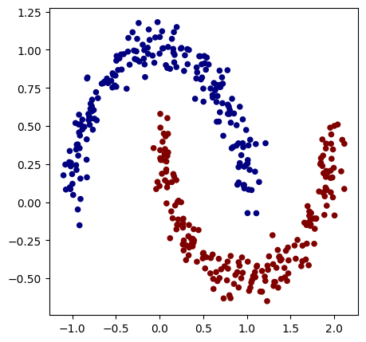
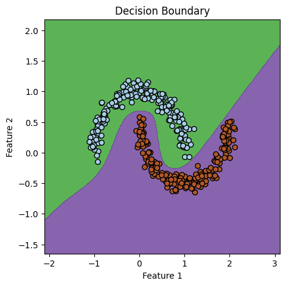

# wingrad - a vectorized translation of Andrej Karpathy's 'micrograd'

See the original micrograd here: https://github.com/karpathy/micrograd

Wingrad, like micrograd, is a small autograd engine that implements backpropagation over a directed acylcic graph (DAG). It allows for the construction of multilayer perceptrons out of Tensor objects, which are detailed below.

To install wingrad:

```
pip install -i https://test.pypi.org/simple/ wingrad
```

## How it works

A Tensor, as defined in the file `tensor.py`, is essentially an array of values on which operations like addition, subtraction, element-wise multiplication, dot multiplication, activation functions, etc. can be called. Each Tensor keeps track of the other Tensors that made it by some operation. As a computation graph is built up from subsequent operations of tensors on one another, a call of the backward() method on a Tensor will create a topologically sorted list of Tensors that came before it. Going through that list in reverse order, it will find the derivatives of the last Tensor in the graph with respect to all other tensors that came before it. This is an application of the chain rule from calculus, and is known in machine learning as reverse-mode automatic differentiation, or autodiff.

In neural networks, and specifically for supervised deep learning problems, reverse-mode autodiff is useful because it allows for the adjustment of network parameters based on the negative gradient of a loss function, also known as gradient descent optimization. The loss function is computed after a forward pass through the network, which is a function of how close the network was to predicting the right value or set of values. By finding the derivatives of the loss function with respect to each individual network parameter, it is possible to improve the network's performance by nudging the parameter values up or down to drive the loss function to a small value, ideally zero. 

## Main differences between wingrad and micrograd

### The use of Tensors vs. Values
While wingrad and micrograd both allow for the construction of neural nets using DAGs and reverse-mode autodiff, wingrad is slightly more complex in its implementation because of its use of array-like Tensor objects, as opposed to Value objects, which hold single scalar values. In neural nets, Tensors allow us to take advantage of the parallelized structure of GPUs and CPUs, leading to faster calculations of layer activations and gradients of parameters. All of this means we are able to train neural network models much faster. This kind of defeats the purpose of micrograd as an in-depth teaching tool, but it was a fun challenge to implement Tensors into wingrad. Below is the Tensor class's `__init__()` method for reference.

```python
class Tensor:
    
    def __init__(self, data, _children=(), _op=''):
        data = data if isinstance(data, np.ndarray) else np.array(data)
        self.data = data                        # the tensor's data
        self.grad = np.zeros_like(data)         # gradient/derivative of the tensor w.r.t. whatever tensor _backward() was called on
        self._backward = lambda: None           # _backward() function, depends on what operation made the tensor
        self._prev = set(_children)             # set of the two tensors that made the tensor by some operation
        self._op = _op                          # operation that made the tensor from its child tensors
        self.shape = self.data.shape            # dimensions of the tensor's data
```

### Non-recursive backward() method
Wingrad's backward() method serves the same purpose as the backward() method in micrograd, which is to create a topologically ordered computation graph and implement backpropagation through that graph. However, while micrograd uses recursion to populate an ordered list of nodes, wingrad takes a different approach, using a simple while loop and double ended queue, or stack. It is a simple implementation of Kahn's algorithm. This allowed for larger training sets, as the recursive approach would often throw recursion depth errors for large datasets. 

```python
# autograd method
def backward(self):

    topo = []
    visited = set()
    stack = deque([self])

    # topologically sort all tensors in computation graph in reverse order
    while stack:
        node = stack.popleft()
        if node not in visited:
            visited.add(node)
            stack.extend(node._prev)
            topo.append(node)
        
    # go through all tensors and apply _backward() function to get gradients
    self.grad = np.ones_like(self.data)
    for tensor in topo:
        tensor._backward()
```

### No Neuron class
Because of the parallel operations between Tensors, there was no need to create a separate Neuron class to define each neuron's characteristics. Instead, neurons in wingrad are represented in the Layer class (in `net.py`) by their weights, biases, and activations alone. Computations of a layer's activations, gradients of its parameters, and updates to its parameters happen more or less simultaneously thanks to the NumPy library's efficient linear algebra operations.

```python
# a layer of neurons
class Layer(Module):

    def __init__(self, nin, nout):
        self.w = Tensor(np.random.randn(nout, nin))     # tensor of all weights in a layer
        self.b = Tensor(np.zeros((nout, 1)))            # tensor of all biases in a layer

    def __call__(self, x):
        wx = self.w ^ x     # weighted sum of weights and inputs (dot product)
        z = wx + self.b     # raw neuron activations
        a = z.tanh()        # z fed through activation function
        return a
    
    # parameters of a layer
    def parameters(self):
        return [self.w] + [self.b]
```

## Demos

For an idea of what can be done with wingrad, please take a look at the `demos/` directory. It includes a few examples of classification problems, ranging from simple, tiny datasets, to the full mnist dataset. Below is a demo of basic Tensor operations that can be called, as well as a simple demo of what the backward() method does.

#### Basic demo of Tensor operations
```python
a = Tensor([[1.0, 2.0, 3.0],
            [4.0, 5.0, 6.0],
            [7.0, 8.0, 9.0]])

b = Tensor([[1.0],
            [2.0],
            [3.0]])

c = Tensor(-0.5)
d = Tensor([[5.0, -1.0, -2.0, 4.0, 9.0]])

e = a ^ b          # dot product of and b
f = c + d          # addition of c and d (broadcasting)
g = e * c          # elementwise multiplication of e and c
h = g**3           # taking g to the power of 3
f.sum(axis=1)      # summing elements of f over rows
i = b.tanh()       # putting b through tanh function
j = i.transpose()  # taking the transpose of i 
a.sum(axis=0)      # summing elements of a over columns
b.reshape((1, 3))  # reshaping from (3, 1) to (1, 3)

```
#### Output:
```
e:  Tensor(data=[[14.]
                 [32.]
                 [50.]])

f:  Tensor(data=[[ 4.5 -1.5 -2.5  3.5  8.5]])

g:  Tensor(data=[[ -7.]
                 [-16.]
                 [-25.]])

h:  Tensor(data=[[  -343.]
                 [ -4096.]
                 [-15625.]])

f summed over rows:  Tensor(data=[12.5])

i:  Tensor(data=[[0.76159416]
                 [0.96402758]
                 [0.99505475]])

j:  Tensor(data=[[0.76159416 0.96402758 0.99505475]])

a summed over columns:  Tensor(data=[12. 15. 18.])

b with new shape:  Tensor(data=[[1. 2. 3.]])
```

#### Demo of backward() method
```python
# demo of backward() method
a = Tensor([[1.0, 2.0, 3.0],
            [4.0, 5.0, 6.0],
            [7.0, 8.0, 9.0]])

b = Tensor([[1.0, 1.0, 1.0],
            [1.0, 1.0, 1.0],
            [1.0, 1.0, 1.0]])

c = Tensor([[10., 11., 12.],
            [13., 14., 15.], 
            [16., 17., 18.]])

d = Tensor([[-0.5, 0.5, -0.5],
            [0.5, -0.5, 0.5],
            [-0.5, 0.5, -0.5]])

e = a ^ b
f = c + d
g = e * f

g.backward()   # find derivatives of g w.r.t all other Tensors 
```

#### Output:
```
g:  Tensor(data=[[ 57.   69.   69. ]
                 [202.5 202.5 232.5]
                 [372.  420.  420. ]])

derivative of g w.r.t a:  [[32.5 32.5 32.5]
                           [42.5 42.5 42.5]
                           [50.5 50.5 50.5]]

derivative of g w.r.t b:  [[172.  188.  196. ]
                           [210.5 230.5 240.5]
                           [249.  273.  285. ]]

derivative of g w.r.t c:  [[ 6.  6.  6.]
                           [15. 15. 15.]
                           [24. 24. 24.]]

derivative of g w.r.t d:  [[ 6.  6.  6.]
                           [15. 15. 15.]
                           [24. 24. 24.]]
```




